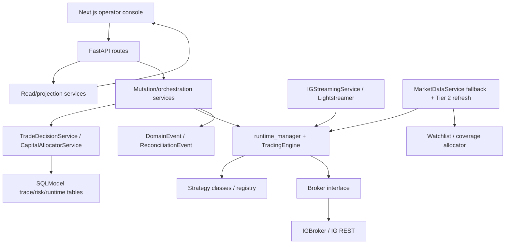

# System architecture

InvestMate is a stateful FastAPI backend plus a Next.js operator console. The current architecture is service-oriented inside a monorepo, with SQLModel persistence and a broker abstraction over IG Markets.

## Architecture overview

## Architecture requirements

| Spec ID | Requirement | Evidence expected | Severity if violated | Current verification confidence |
| --- | --- | --- | --- | --- |
| ARCH-001 | Backend routes MUST remain thin. Routes may validate HTTP inputs, call services, translate service errors into HTTP responses, and shape response models. Routes must not contain trading lifecycle decisions, broker order logic, risk admission logic, reconciliation logic, or runtime orchestration. | Route functions call service methods rather than implementing trading, broker, risk, reconciliation, or runtime logic inline. | P2 | Medium |
| ARCH-002 | TradeIntent is the authoritative decision boundary before broker execution. | Decision-service and strategy-service tests. | P0 | High |
| ARCH-003 | Execution is execution-attempt audit and must stay linked to an intent wherever possible. | `Execution.trade_intent_id`, execution lifecycle tests. | P0 | High |
| ARCH-004 | Broker access must go through broker-neutral interfaces outside adapter code. | `Broker` interface use and tests for broker-neutral allocation. | P1 | Medium |
| ARCH-005 | Read services and passive UI surfaces must not mutate operational state. | Side-effect-free tests for read routes/services. | P1 | Medium |
| ARCH-006 | Governance, deployment, and runtime are separate concepts and must not be collapsed. | Control-plane model/service tests. | P1 | High |
| ARCH-007 | Deployment state must not imply runtime alignment without explicit alignment checks. | Control-plane alignment model and tests. | P1 | High |
| ARCH-008 | Operational state must distinguish live stream, fallback polling, stale data, disconnected data, and broker disconnection. | Operational-state and market-data tests. | P1 | High |
| ARCH-009 | Frontend API types must track backend response fields used by operator surfaces. | `frontend/lib/types.ts`, route models or documented dict responses. | P1 | Medium |
| ARCH-010 | Every backend route must have an explicit route classification: passive read, active read/refresh, mutation, or broker action. HTTP method alone is not sufficient proof of behavior. | Route inventory in `04-backend-api-contract.md`, route tests for side effects, and review evidence for indirect service calls. | P1 | Medium |
| ARCH-011 | Broker mutations may only originate from explicit broker-action or mutation workflows that satisfy lifecycle, safety, and audit requirements. | Broker mutation call graph, intent/execution/reconciliation evidence, and broker failure tests. | P0 | Medium |
| ARCH-012 | The frontend/backend contract must be owned by backend route schemas or documented response contracts plus matching frontend types. Frontend code must not invent operational truth absent from backend fields. | Pydantic response models or documented dict shapes, `frontend/lib/types.ts`, and UI contract tests. | P1 | Medium |
| ARCH-013 | Runtime state changes must preserve open-risk safety. Starts, stops, recovery, deployment reconcile, and mode changes must not silently erase `EXITS_ONLY`, `UNMANAGED_OPEN_RISK`, manual ownership, or broker-linked open exposure. | Runtime/deployment/control-plane tests, persisted runtime state, and domain events for safety-relevant transitions. | P0 | High |
| ARCH-014 | Broker reconciliation MUST run as an independent leader-owned supervision function. Empty watchlist, disabled streaming, no active strategy deployment, or no current entry candidate must not suppress broker-position discovery. | Lifespan/supervisor tests plus empty-watchlist reconciliation regressions. | P0 | High |
| ARCH-015 | Leader-owned external side effects MUST be fenced by a monotonic leadership generation immediately before the side effect and for its full mutation window. Lease heartbeat alone is insufficient; takeover must not overlap a stale leader's broker mutation. | Generation takeover tests, stale-owner rejection tests, adapter-boundary tests, and production-dialect lock rehearsal. | P0 | High |

## Route classification

Every backend route should be classified as one of:

- Passive read: observes existing state only; no writes, commits, flushes, seeding, reconciliation, alert refresh, broker mutation, runtime mutation, or event creation.
- Active read/refresh: returns a read model but may intentionally refresh or persist derived state. Must be named, documented, and treated as mutation-like for audit purposes.
- Mutation: intentionally changes local operational state, broker state, governance, runtime, watchlist, alerts, reviews, or audit events.
- Broker action: may place, close, amend, or inspect broker-side state and must have explicit safety and audit requirements.

Route classification rules:

- GET does not automatically mean passive read. A GET route that persists reviews, refreshes alerts, seeds defaults, reconciles broker state, creates events, or mutates runtime/watchlist/governance state is an active read/refresh or mutation-like route.
- Passive read routes must be testable with before/after database assertions and forbidden-call guards for broker mutation, reconciliation, seeding, event creation, runtime mutation, and alert refresh.
- Active read/refresh routes must explain what state may be refreshed, why the refresh is safe, and how operators can distinguish refreshed derived state from broker/live truth.
- Mutation and broker-action routes must expose side effects in route naming, request body, frontend controls, and response/error behavior.
- Route classifications live primarily in `04-backend-api-contract.md`; this architecture spec defines the classification model and review standard.

## Broker mutation authority

Broker-side mutations include order placement, position close, amendment, cancellation if added later, and any call that can change broker account or position state. These calls must be treated as P0/P1 architecture paths.

Broker mutation rules:

- Application code outside broker adapters must use broker-neutral interfaces and must not build raw IG payloads.
- Entry order submission must be linked to an approved `TradeIntent` and an auditable execution attempt.
- Exit/close broker actions must preserve an exit-capable path for known open risk and must not be blocked by entry-only allocation constraints.
- Reconciliation and recovery may inspect broker state and create explicit lifecycle evidence, but must not silently rewrite local truth.
- Broker mutation failures, ambiguous confirmations, partial fills, and manual-review states must remain visible through persisted state and operator surfaces.

## Frontend/backend contract rules

The frontend is an operator console over backend truth, not an independent source of trading truth.

Contract rules:

- Backend fields used by the frontend must be present in route response models, documented dict response contracts, or this spec set.
- Frontend enum/status unions must include backend states that can be returned by current code, including transitional and degraded states.
- Frontend components may derive presentation summaries, but derived values must not imply stronger certainty than backend provenance, confidence, or freshness supports.
- Fallback, stale, estimated, provisional, unknown, and unavailable values must remain distinguishable from exact broker-confirmed or live-streaming values.
- API changes affecting frontend fields must update `04-backend-api-contract.md`, `05-frontend-operator-ui-contract.md`, and `frontend/lib/types.ts` together.

## Runtime safety invariants

Runtime state is the operational reality of what is running. Deployment is the system's autonomous intent; governance is permission; runtime is actual execution context.

Runtime safety rules:

- `MANUAL` and `AUTO` control modes must not be silently reclassified.
- `NORMAL`, `EXITS_ONLY`, and `STOPPED` runtime modes must not be silently changed by route handlers or frontend assumptions.
- `EXITS_ONLY` is a protective state for open risk and must not be reset to `NORMAL` by default starts, deployment reconcile, or recovery without an explicit owner and audit trail.
- `UNMANAGED_OPEN_RISK` must be operator-visible and must block unsafe normal restarts unless a documented recovery/exit path handles the risk.
- Deployment/runtime mismatch must be surfaced as mismatch, not hidden by deployment state labels.
- Runtime recovery must reconstruct or explicitly mark lifecycle state before treating broker-discovered exposure as managed.

## Backend layers

| Layer | Responsibility | Current files |
| --- | --- | --- |
| API routes | HTTP shape, route classification, status/error translation. | `backend/app/api/routes/*`, `backend/app/api/router.py` |
| Services | Domain orchestration, projections, state transitions, reconciliation, deployment, risk/allocation. | `backend/app/services/*` |
| Core runtime | Broker abstractions, runtime manager, trading engine, settings, logging. | `backend/app/core/*` |
| Strategies | Entry/exit/screening logic and registry metadata. | `backend/app/strategies/*` |
| Models | SQLModel persisted operational truth. | `backend/app/models/*` |
| Reviewer/AIMEE | Operator summaries and passive AIMEE snapshots. | `backend/app/reviewer/*`, `backend/app/services/aimee_read_service.py` |

## Frontend layers

| Layer | Responsibility | Current files |
| --- | --- | --- |
| App routes | Server-side page data loading and initial fallback state. | `frontend/app/*/page.tsx` |
| API client | Backend route calls, timeouts, fallback metadata. | `frontend/lib/api.ts` |
| Types | Frontend response assumptions. | `frontend/lib/types.ts` |
| Operator components | Dashboard, control plane, coverage, risk, markets, strategies, AIMEE. | `frontend/components/*` |
| Formatting/read models | UI-derived summaries and labels. | `frontend/lib/format.ts`, `frontend/lib/live-system-view.ts`, `frontend/lib/risk-allocation.ts` |

## Ownership of system truth

| Truth | Owner | Notes |
| --- | --- | --- |
| Pre-trade decision | `TradeIntent` through `TradeDecisionService` | Authoritative for approval/rejection/admission. |
| Broker attempt | `Execution` through `StrategyService`/`TradeService` | Audit trail after admission or close path. |
| Open exposure | `Position`, reconciled with broker positions | May be local/provisional until broker-confirmed. |
| Closed outcome | `Trade` | Realized close result. |
| Governance | `StrategyFamilyGovernance` | Operator policy. |
| Deployment | `StrategyDeployment` | System-owned autonomous lifecycle. |
| Runtime | `StrategyRuntimeState` plus `runtime_manager` | Running engine and persisted restart state. |
| Market-data freshness | `runtime_manager`, streaming health, operational-state service | Must expose stale/fallback/disconnected distinctions. |
| Risk truth | `TradeIntent`, `Execution`, `Position`, `Trade`, allocation read model | Confidence label required when degraded/estimated. |
| Open-risk management authority | `OpenRiskAuthority` through `OpenRiskAuthorityService` | One versioned risk-book snapshot owns per-position runtime authority, manual-review state, broker sync, and reconciliation freshness. Deployment fields are compatibility projections. |
| AIMEE passive state | `AimeeReadService` projection | Must stay read-only. |

## Must-not-cross boundaries

| Boundary ID | Boundary | Rule | Required evidence | Severity |
| --- | --- | --- | --- | --- |
| ARCH-BND-001 | Decision vs execution | Execution records must not be used as the authoritative pre-trade decision state. | Decision/execution lifecycle tests. | P0 |
| ARCH-BND-002 | Broker adapter | IG raw payload, pip/point/contract semantics, session headers, and Lightstreamer details must not leak into unrelated services. | Broker-boundary code review and sizing tests. | P1 |
| ARCH-BND-003 | Read vs mutation | Passive read routes/services must not call mutation workflows or persist operational side effects. | No-write route/service tests. | P1 |
| ARCH-BND-004 | Governance vs deployment | Governance approval must not be represented as runtime/deployment alignment. | Control-plane alignment tests. | P1 |
| ARCH-BND-005 | Deployment vs runtime | A deployment state can say what the system wants, but runtime state must prove what is running. | Runtime/deployment mismatch tests. | P1 |
| ARCH-BND-006 | UI vs backend truth | Frontend must not infer exactness, freshness, or approval beyond backend fields. | Frontend state-label and provenance tests. | P1 |

## Known unknowns

- Some route responses are raw `dict[str, object]`, making frontend contract stability harder to review.
- Read-oriented routes such as allocation alerts can optionally refresh/persist alert state depending on query parameters; this must be documented as mutation-like behavior.
- Broker failure handling relies on fakes for many tests; live IG edge cases may differ.
- Market-data fallback is intentionally useful but degraded; all UI surfaces must keep that distinction visible.
- Default governance seeding is implemented in services and can be triggered by reads in some areas; this should be audited route-by-route.

## Required tests

- Architecture boundary tests for TradeIntent/Execution separation.
- Route tests for read/mutation classification.
- Broker-boundary tests proving app services consume normalized broker objects.
- Control-plane tests proving governance/deployment/runtime alignment is explicit.
- Frontend tests proving degraded/fallback/estimated states render differently from exact healthy states.

## Audit questions for Codex

- Which GET endpoints call services that seed defaults, refresh alerts, reconcile broker state, or otherwise write?
- Which response shapes are untyped dicts but consumed by frontend TypeScript types?
- Can a runtime restart erase `EXITS_ONLY` or `UNMANAGED_OPEN_RISK` state?
# Backtesting architecture

The historical simulation subsystem is isolated from the live autonomy and broker lifecycle. Its authoritative contract is [11-backtesting-contract.md](11-backtesting-contract.md).

- `app/backtesting/providers.py` owns broker-neutral ingestion provider contracts.
- `app/backtesting/storage.py` owns immutable local partition storage.
- `app/core/strategy_evaluation.py` is shared by live `TradingEngine` and historical replay.
- `app/backtesting/replay.py` owns event-time ordering and simulation orchestration.
- `app/backtesting/execution.py` owns deterministic simulated fills and position lifecycle.
- `app/models/backtest.py` contains only historical dataset and simulation records.

The replay subsystem must not call the live broker factory, runtime manager, trade decision service, strategy service, reconciliation, deployment, telemetry, or allocation-alert services.
