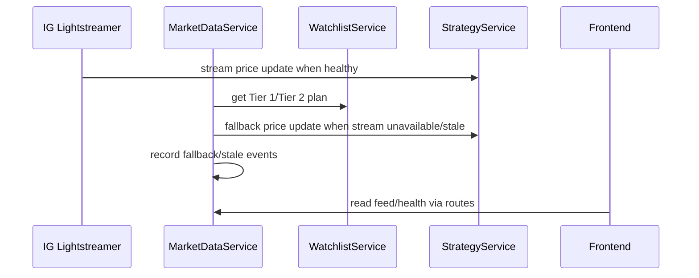

# End-to-end flows

This document defines the main full-stack flows. Do not claim a flow is fully verified unless tests exist for the success and important failure paths.

## Flow verification levels

Use these labels when auditing flow coverage:

- `NOT_VERIFIED`: documented behavior exists, but no meaningful automated test evidence was identified.
- `UNIT_VERIFIED`: isolated unit tests exist, but the flow is not verified across service boundaries.
- `SERVICE_VERIFIED`: service-level tests verify meaningful success and failure behavior.
- `ROUTE_VERIFIED`: API route tests verify request/response shape, side effects, errors, and persistence behavior.
- `FULL_STACK_VERIFIED`: backend route/service/persistence behavior and frontend API consumption are tested together through realistic fixtures or integration tests.
- `E2E_VERIFIED`: browser or true end-to-end tests verify operator-visible behavior through the frontend.

A flow must not be described as fully verified unless success, important failure modes, persistence effects, API behavior, and operator-visible frontend states are covered by tests.

## Flow verification matrix

| Flow ID | Criticality | Required evidence | Minimum test expectation | Target verification level | Current verification confidence |
| --- | --- | --- | --- | --- | --- |
| FLOW-MARKET-DATA-001 | P1 | Streaming/fallback/stale code paths, health state, frontend display. | Service tests for fallback/stale and UI tests for degraded display. | `FULL_STACK_VERIFIED` | Needs audit |
| FLOW-ENTRY-001 | P0 | Durable `TradeIntent`, allocation/risk audit, approved-intent-only execution, broker mutation audit. | Behavioral integration tests for success plus stale/broker/risk rejection cases. | `FULL_STACK_VERIFIED` with `E2E_VERIFIED` desirable later | Needs audit |
| FLOW-EXIT-001 | P0 | Close-capable intent/execution path, broker close audit, open-position preservation on failure. | Behavioral tests for success, broker failure, partial close, stale/broker disconnect cases. | `FULL_STACK_VERIFIED` | Needs audit |
| FLOW-RUNTIME-001 | P1 | Persisted runtime state, control mode, runtime mode, recovery behavior. | Tests for manual/AUTO, `EXITS_ONLY`, restart, stopped recovery. | `ROUTE_VERIFIED` or `FULL_STACK_VERIFIED` | Needs audit |
| FLOW-GOVERNANCE-001 | P1 | Governance/deployment/runtime separation and open-risk management state. | Tests for approval, emergency stop, mismatch, unmanaged open risk. | `FULL_STACK_VERIFIED` | Needs audit |
| FLOW-COVERAGE-001 | P1 | Watchlist state, streaming plan, protective pins, promotion allocation. | Tests for caps, cooldown, protective coverage, stale stream. | `FULL_STACK_VERIFIED` | Needs audit |
| FLOW-RISK-001 | P0 | Allocation budgets, risk truth confidence, alerts, post-fill risk. | Tests for budget limits, stale data, degraded sizing, fill-derived truth, alert persistence. | `FULL_STACK_VERIFIED` | Needs audit |
| FLOW-AIMEE-001 | P1 | Passive snapshot side-effect-free behavior. | Route/service tests proving no writes and no forbidden service calls. | `ROUTE_VERIFIED` plus frontend API/client verification | Needs audit |
| FLOW-RECOVERY-001 | P0 | Explicit recovery/adoption/forced-close lifecycle state. | Tests for startup recovery, unmatched broker position, broker-missing local position. | `SERVICE_VERIFIED` or `ROUTE_VERIFIED`, with frontend visibility tests | Needs audit |

## Flow documentation standards

Every flow should document:

- Purpose.
- Trigger.
- Backend path.
- API routes involved.
- Route classification for those APIs.
- Database writes.
- Broker reads.
- Broker mutations.
- Frontend surfaces.
- Operator-visible success state.
- Operator-visible degraded/failure/manual-review state.
- Tests.
- Failure modes.
- Invariants.
- Current verification level.
- Current verification gaps.

If a flow crosses a safety-critical boundary, the flow must show where lifecycle authority, persistence, broker action, and operator visibility are established.

## Common full-stack invariants

- No entry broker mutation may occur without approved `TradeIntent` authority.
- Exit and close paths must preserve open-risk ownership when broker close confirmation is unsafe, partial, failed, or ambiguous.
- Broker confirmation ambiguity must produce explicit pending, manual-review, reconciliation-needed, or degraded state rather than silent success/failure.
- Passive read flows must not write operational state unless explicitly classified as active read/refresh.
- Frontend surfaces must not infer or upgrade backend lifecycle, broker, market-data, risk, or confidence truth.
- Every P0/P1 failure mode must produce operator-visible evidence through status fields, events, alerts, manual-review state, or degraded UI.
- Recovery/adoption/reconciliation flows must be distinguishable from normal strategy-owned lifecycle flows.
- Tests must cover failure-closed behavior, not only happy-path success.

## FLOW-MARKET-DATA-001 — Market data ingestion

| Field | Current evidence |
| --- | --- |
| Purpose | Provide fresh prices, market status, coverage promotion, and runtime price updates. |
| Trigger | Backend startup launches market data loop; streaming loop may also run when enabled. |
| Backend path | `main.py` startup -> `MarketDataService.run`; `IGStreamingService.run`; `StrategyService.process_price_update`. |
| API routes | `GET /health/stream` — `PASSIVE_READ`; `GET /system/telemetry` — `PASSIVE_READ`; `GET /market-data/feed-state` — `PASSIVE_READ`; `GET /market-data/feed-state/{instrument_id}` — `PASSIVE_READ`; `GET /live/instruments/{instrument_id}/chart` — `PASSIVE_READ`; `GET /coverage/summary` — `PASSIVE_READ`; `GET /markets/overview` — `BROKER_READ`. |
| Database writes | Domain events for fallback/stale/recovered/Tier 2 refresh/promotion/allocation/deployment; promotion/watchlist timestamps. |
| Broker reads | `get_market_details` for fallback and Tier 2 refresh; streaming credentials/subscriptions through IG streaming. |
| Broker mutations | None expected. |
| Side-effect classification | Background mutation flow; writes events/promotion/watchlist timestamps; broker reads; no broker mutation expected. |
| Frontend surfaces | Dashboard stream health, coverage feed state, markets chart/feed state, live view. |
| Operator-visible success state | Fresh-enough stream/feed state, market/coverage summaries, live chart/feed surfaces, and telemetry display healthy-but-provenanced source state. |
| Operator-visible failure/degraded state | Stream disconnected, stale, fallback, broker-unavailable, or unsupported-chart states are visible; fallback price data remains degraded and must not look like healthy stream truth. |
| Tests | `test_market_data_service.py`, `test_ig_streaming_watchlist.py`, `test_operator_watchlist_feature.py`, `test_operational_state_service.py`. |
| Failure modes | Stream unavailable, no ticks, stale stream, broker market details unavailable, unsupported chart instrument. |
| Invariants | Streaming health and fallback polling are separate truths. Fallback polling must not mark streaming healthy. Fallback-derived prices must carry degraded/fallback provenance. Price availability alone must not imply entry eligibility. Stale stream and broker market-details failure must be operator-visible. `BROKER-006`, `RISK-002`, `UI-002`, `UI-011`. |
| Current verification level | `SERVICE_VERIFIED` based on identified backend tests; frontend/full-stack coverage needs audit. |
| Current verification gaps | Needs frontend tests proving fallback/stale/disconnected states are displayed distinctly. Needs audit that fallback does not set `stream_connected=true` or equivalent healthy stream state. |

## FLOW-ENTRY-001 — Entry decision and execution

| Field | Current evidence |
| --- | --- |
| Purpose | Convert a strategy entry signal into approved/rejected decision and, if approved, broker execution. |
| Trigger | Price update produces strategy candidate. |
| Backend path | `StrategyService.process_price_update` -> allocation/risk/decision -> `TradeDecisionService` -> `StrategyService._execute_entry_signal`. |
| API routes | Mostly internal/runtime-triggered. Operator-visible via `GET /executions` — `PASSIVE_READ`; `GET /positions` — `PASSIVE_READ`; `GET /trades` — `PASSIVE_READ`; `GET /allocation/intents` — `PASSIVE_READ`; `GET /allocation/cycles` — `PASSIVE_READ`; `GET /allocation/drift` — `PASSIVE_READ`; `GET /events` — `PASSIVE_READ`. Runtime start routes that may later enable entries: `POST /strategy/start` — `MUTATION`; `POST /strategies/{name}/start` — `MUTATION`. No direct entry-order API route identified. |
| Database writes | `AllocationCycle`, `TradeIntent`, `Execution`, `Position`, domain events. |
| Broker reads | Account summary, market details, risk sizing quote, size normalization. |
| Broker mutations | Order placement. |
| Side-effect classification | Internal mutation flow with broker mutation; requires approved `TradeIntent`. |
| Frontend surfaces | Dashboard executions/positions/risk, strategies executions, allocation/risk drawer, events. |
| Operator-visible success state | Approved `TradeIntent`, `Execution`, `Position` where applicable, allocation/risk evidence, and event trail are visible in dashboard, risk, execution, and event surfaces. |
| Operator-visible failure/degraded state | Rejected or blocked intent is visible without broker order attempt. Broker submission failure, pending/manual-review, partial fill, timeout, or ambiguous outcome is visible through execution, events, alerts, or degraded risk/position truth. |
| Tests | `test_trade_decision_service.py`, `test_strategy_service.py`, `test_intent_lifecycle_integration.py`, `test_capital_allocator_service.py`, `test_portfolio_risk_service.py`, `test_allocation_read_service.py`. |
| Failure modes | Stale price, market closed/untradable, broker metadata unavailable, below min size, budget exceeded, operational entry blocked, broker submission failure, partial fill, broker timeout, confirmation lookup failure, ambiguous broker response, rate limit, client request id/idempotency mismatch, simulated/local fill mistaken for broker-confirmed fill. |
| Invariants | No entry broker mutation without approved intent authority. Rejected or blocked candidates do not create broker order attempts. Ambiguous, partial, failed, or timed-out broker outcomes must not become exact success silently. `BROKER-003`, `BROKER-011`, `BROKER-012`, `BROKER-013`, `RISK-001`, `RISK-002`, `STATE-001`, `STATE-002`. |
| Current verification level | `SERVICE_VERIFIED`; broader route/frontend/full-stack verification needs audit. |
| Current verification gaps | Needs route/frontend visibility verification for rejected/stale/broker-failed/partial/ambiguous outcomes. Needs audit that every `place_order` path traces back to approved intent authority. |

FLOW-ENTRY-001 expected steps:

1. Strategy emits entry candidate from fresh-enough market input.
2. Allocation/risk checks broker/account/market/sizing context.
3. `TradeDecisionService` persists `TradeIntent` as `PROPOSED` and then `APPROVED` or `REJECTED`.
4. Rejected or blocked candidates do not create broker order attempts.
5. Approved intents may create `Execution` records and broker order attempts.
6. Broker result updates execution, position, risk truth, events, and operator-visible read models.
7. Partial, failed, timeout, or ambiguous broker outcomes remain visible and do not become exact success silently.

## FLOW-EXIT-001 — Exit decision and close

| Field | Current evidence |
| --- | --- |
| Purpose | Close open exposure while preserving audit and manual-review state on failure. |
| Trigger | Strategy exit signal, runtime exits-only path, or reconciliation/recovery close path. |
| Backend path | `StrategyService` close execution path; `TradeService` updates intent/execution/position/trade. |
| API routes | Mostly internal/runtime/recovery-triggered. Operator-visible via `GET /executions` — `PASSIVE_READ`; `GET /positions` — `PASSIVE_READ`; `GET /trades` — `PASSIVE_READ`; `GET /allocation/exposure` — `PASSIVE_READ`; `GET /events` — `PASSIVE_READ`. Runtime/governance routes that may affect exits-only handling: `POST /strategy/stop` — `MUTATION`; `POST /strategies/{name}/stop` — `MUTATION`; control-plane mode routes — Needs audit. |
| Database writes | Close `TradeIntent` states, close `Execution`, `Trade`, `Position` close fields, events. |
| Broker reads | Broker state checks/reconciliation reads as needed around ambiguous close handling — Needs audit. |
| Broker mutations | `close_position`. |
| Side-effect classification | Internal mutation flow with broker mutation; requires known open risk, recovery/reconciliation authority, or explicit operator authority. |
| Frontend surfaces | Dashboard positions/trades/executions, strategies, events, risk. |
| Operator-visible success state | Closed or reduced position/trade/execution state is visible with correlated event/audit evidence and updated exposure/risk truth. |
| Operator-visible failure/degraded state | Position remains visibly open or partial. Failed or ambiguous close creates manual-review/reconciliation-needed/degraded evidence, and open risk remains operator-visible. |
| Tests | `test_strategy_service.py` close failure/partial close/exits-only tests; integration lifecycle tests. |
| Failure modes | Broker close failure, partial close, stale data, broker disconnected, missing linked intent, broker close timeout, ambiguous close confirmation, missing broker reference, close failure leaves open risk unmanaged, duplicate close attempt after ambiguous outcome. |
| Invariants | Exit and close paths must preserve open-risk ownership. Partial, failed, timeout, or ambiguous close must keep open risk visible and auditable. `BROKER-004`, `BROKER-011`, `BROKER-012`, `STATE-005`, `RISK-007`. |
| Current verification level | `SERVICE_VERIFIED`; route/frontend visibility coverage needs audit. |
| Current verification gaps | Needs tests for ambiguous close confirmation and duplicate close prevention. Needs frontend tests proving close failure does not disappear from operator view. |

FLOW-EXIT-001 expected steps:

1. Exit is triggered by strategy signal, exits-only runtime, operator/recovery path, or reconciliation path.
2. System verifies known open risk or recovery/reconciliation/operator authority.
3. Close `Execution` or equivalent audit record is created where applicable.
4. Broker close is requested with correlation evidence where supported.
5. Full close updates position/trade/outcome evidence.
6. Partial, failed, timeout, or ambiguous close keeps open risk visible and moves to manual-review/reconciliation-needed/degraded state.
7. UI surfaces open/partial/unmanaged/manual-review state to the operator.

## FLOW-RUNTIME-001 — Runtime lifecycle

| Field | Current evidence |
| --- | --- |
| Purpose | Start, stop, recover, and mode-manage strategy runtimes. |
| Trigger | Operator start/stop, deployment reconcile, backend startup recovery, partial fill restrictions. |
| Backend path | `StrategyService.start_strategy/stop_strategy/set_runtime_mode`, `RuntimeRecoveryService`, `runtime_manager`. |
| API routes | `POST /strategy/start` — `MUTATION`; `POST /strategy/stop` — `MUTATION`; `POST /strategies/{name}/start` — `MUTATION`; `POST /strategies/{name}/stop` — `MUTATION`; `GET /strategies` — `PASSIVE_READ`; `GET /executions` — `PASSIVE_READ`. |
| Database writes | `StrategyRuntimeState`, domain events. |
| Broker reads | Broker reads during strategy execution/recovery; no direct mutation from start alone identified. |
| Broker mutations | None from start/stop alone identified. Later runtime price processing may participate in entry/exit flows. |
| Side-effect classification | Operator/system mutation flow; runtime state writes; no broker mutation from start alone unless later price processing triggers entry. |
| Frontend surfaces | Strategies page, control plane, live view. |
| Operator-visible success state | Runtime state, control mode, runtime mode, and execution visibility align with operator action and remain distinguishable from governance/deployment. |
| Operator-visible failure/degraded state | Restart/retarget mismatch, manual-vs-AUTO conflict, stopped recovery, exits-only, emergency-stop, or unmanaged-open-risk states remain visible. |
| Tests | `test_strategy_service.py`, `test_runtime_recovery_service.py`, `test_control_plane_service.py`. |
| Failure modes | Restart erases exits-only, manual/auto ownership conflict, unmanaged open risk. |
| Invariants | Start/stop alone must not imply broker mutation. Runtime mode and control mode must remain distinct. Restart/retargeting must not silently clear `EXITS_ONLY`, emergency stop, manual-review, unmanaged-open-risk, or protective-exit state. Manual runtime must not be displayed as autonomous deployment alignment. `STATE-003`, `STATE-005`. |
| Current verification level | `SERVICE_VERIFIED`; route/frontend verification needs audit. |
| Current verification gaps | Needs restart/retargeting tests covering protective state preservation. Needs frontend tests for manual vs `AUTO` and `NORMAL` vs `EXITS_ONLY` vs `STOPPED`. |

## FLOW-GOVERNANCE-001 — Governance/deployment/control plane

| Field | Current evidence |
| --- | --- |
| Purpose | Apply operator policy and system-owned deployment decisions. |
| Trigger | Operator governance/control updates; deployment reconcile; market/health changes. |
| Backend path | `ControlPlaneService`, `OperatorControlService`, `StrategyGovernanceService`, `StrategyDeploymentManagerService`. |
| API routes | `GET /control-plane/summary` — `PASSIVE_READ`; `GET /control-plane/operator-state` — `PASSIVE_READ`; `PUT /control-plane/operator-state` — `MUTATION`; `GET /control-plane/strategies/{strategy_name}` — `PASSIVE_READ`; `POST /control-plane/reconcile` — `MUTATION`; `PUT /control-plane/governance/{strategy_name}` — `MUTATION`. |
| Database writes | `OperatorControlState`, `StrategyFamilyGovernance`, `StrategyDeployment`, runtime state, events. |
| Broker reads | Market/operational reads indirectly via suitability/operational state. |
| Broker mutations | None expected. |
| Side-effect classification | Operator/system mutation flow; governance/deployment/runtime writes. |
| Frontend surfaces | Control plane, dashboard strip, AIMEE snapshot. |
| Operator-visible success state | Governance, deployment, runtime, alignment, emergency stop, and open-risk management are separately visible and auditable. |
| Operator-visible failure/degraded state | Governance/runtime mismatch, deployment/runtime mismatch, emergency-stop block, exits-only state, and unmanaged open risk remain visible rather than collapsed into a healthy summary. |
| Tests | `test_control_plane_service.py`, `test_operational_state_service.py`. |
| Failure modes | Governance approval mistaken for running runtime, emergency stop strands open risk, deployment/runtime mismatch. |
| Invariants | Governance approval is permission, not proof of deployment or runtime. Deployment is system intent, not proof of running runtime. Runtime alignment must be explicitly checked. Emergency stop must fail closed for entries while preserving exit/open-risk handling. Open-risk management state must be operator-visible. `ARCH-006`, `ARCH-007`, `STATE-004`, `STATE-005`. |
| Current verification level | `SERVICE_VERIFIED`; route/full-stack/UI mismatch verification needs audit. |
| Current verification gaps | Needs tests for emergency stop with open risk. Needs UI tests showing governance/deployment/runtime mismatch. |

## FLOW-COVERAGE-001 — Watchlist and coverage

| Field | Current evidence |
| --- | --- |
| Purpose | Allocate scarce Tier 1 streaming slots and use Tier 2 refresh/promotion for broader screening. |
| Trigger | Operator watchlist changes, Tier 2 refresh, promotion allocator, open positions/pending intents. |
| Backend path | `WatchlistService`, `CoverageAllocatorService`, `MarketDataService`, `IGStreamingService`. |
| API routes | `GET /coverage/summary` — `PASSIVE_READ`; `GET /markets/catalogue` — `PASSIVE_READ`; `GET /watchlist/shortlist` — `PASSIVE_READ`; `POST /watchlist/shortlist/{instrument_id}` — `MUTATION`; `DELETE /watchlist/shortlist/{instrument_id}` — `MUTATION`; `GET /strategy-watchlist` — `PASSIVE_READ`; `POST /strategy-watchlist/bulk` — `MUTATION`; `DELETE /strategy-watchlist/{instrument_id}` — `MUTATION`; `GET /market-data/feed-state` — `PASSIVE_READ`. |
| Database writes | `WatchlistEntry`, `OperatorShortlistEntry`, `PromotionRequest`, events. |
| Broker reads | Market details for Tier 2 refresh and live chart/fallback. |
| Broker mutations | None expected. |
| Side-effect classification | Mixed passive read and mutation flow; watchlist mutations explicit; background coverage refresh writes events/promotion state. |
| Frontend surfaces | Coverage, markets, live chart/feed state. |
| Operator-visible success state | Desired coverage, actual streaming coverage, protective pins, promotion candidates, and feed-state distinctions are visible. |
| Operator-visible failure/degraded state | Cap exceeded, cooldown, pinned/protective override, stale stream, fallback-only, or unknown-instrument states remain visible and do not imply trading approval. |
| Tests | `test_watchlist_service.py`, `test_watchlist_tier2_service.py`, `test_coverage_allocator_service.py`, `test_operator_watchlist_feature.py`, `test_ig_streaming_watchlist.py`. |
| Failure modes | Cap exceeded, protective coverage exceeds normal cap, cooldown, stale stream, unknown instrument. |
| Invariants | Watchlist/shortlist does not imply streaming coverage. Streaming coverage does not imply entry eligibility. Protective pins/open positions/pending intents may override normal coverage ranking, but must be visible. Coverage caps/cooldowns/stale streams must be visible. Tier 2 promotion is not approval to trade. `UI-COVERAGE-001`, `BROKER-006`. |
| Current verification level | `SERVICE_VERIFIED`; frontend/full-stack verification needs audit. |
| Current verification gaps | Needs UI tests showing shortlist-only, watchlist-not-streaming, pinned/protective, cap-exceeded, stale-stream, and promotion-pending states. |

## FLOW-RISK-001 — Allocation and risk truth

| Field | Current evidence |
| --- | --- |
| Purpose | Allocate risk budgets, reserve risk for admitted intents, and reconcile post-fill truth. |
| Trigger | Entry candidate cycle, execution fill/update, allocation read/alert refresh. |
| Backend path | `CapitalAllocatorService`, `PortfolioRiskService`, `TradeDecisionService`, `AllocationReadService`, `AllocationAlertService`. |
| API routes | `GET /allocation/cycles` — `PASSIVE_READ`; `GET /allocation/cycles/{cycle_id}` — `PASSIVE_READ`; `GET /allocation/intents` — `PASSIVE_READ`; `GET /allocation/intents/{trade_intent_id}` — `PASSIVE_READ`; `GET /allocation/drift` — `PASSIVE_READ`; `GET /allocation/alerts` — `PASSIVE_READ` by contract when `refresh=false`, Needs audit because code default may differ; `GET /allocation/alerts?refresh=true` — `ACTIVE_READ_REFRESH`; `POST /allocation/alerts/{alert_id}/acknowledge` — `MUTATION`; `POST /allocation/alerts/{alert_id}/resolve` — `MUTATION`; `GET /allocation/alerts/unresolved-critical` — `ACTIVE_READ_REFRESH`, Needs confirmation; `GET /allocation/exposure` — `PASSIVE_READ`. |
| Database writes | `AllocationCycle`, `TradeIntent`, `AllocationAlert`, risk fields on execution/position/trade. |
| Broker reads | Account equity, market details, sizing quote, size normalization. |
| Broker mutations | None in read/alert surfaces; entry/exit broker mutations happen in related flows. |
| Side-effect classification | Mixed internal mutation and read/projection flow; alert refresh may be `ACTIVE_READ_REFRESH` if retained. |
| Frontend surfaces | Dashboard risk panels, risk page/drawer, allocation alerts. |
| Operator-visible success state | Allocation cycles, intents, exposure, and alerts show risk truth with provenance/confidence rather than overstated certainty. |
| Operator-visible failure/degraded state | Budget, concentration, stale data, degraded sizing, provisional/partial/simulated risk, and alert states remain visible. Refresh-by-GET, if retained, is treated as mutation-like. |
| Tests | `test_capital_allocator_service.py`, `test_portfolio_risk_service.py`, `test_allocation_read_service.py`. |
| Failure modes | Budget exhausted, stale signal/price, degraded sizing, revalidation drift, incomplete fill truth, concentration hotspots. |
| Invariants | Allocation approval is not broker execution. Risk truth must include confidence/provenance when estimated, provisional, partial, submitted, allocation-only, simulated, degraded, or unknown. Post-fill risk must not be presented as exact unless fill size/price evidence supports it. Alert refresh via GET `refresh=true`, if retained, must be classified as active read/refresh, not passive read. Budget/concentration/stale/sizing failures must fail closed for entries. `RISK-001` through `RISK-007`. |
| Current verification level | `SERVICE_VERIFIED`; route/frontend/full-stack verification needs audit. |
| Current verification gaps | Needs tests for risk confidence display across backend read models and frontend. Needs audit for allocation alert refresh write-on-read behavior. |

## FLOW-AIMEE-001 — AIMEE passive snapshot

| Field | Current evidence |
| --- | --- |
| Purpose | Give read-only operational explanation without changing operational state. |
| Trigger | Frontend AIMEE drawer refresh calls `/aimee/snapshot`. |
| Backend path | `AimeeReadService.get_snapshot`. |
| API routes | `GET /aimee/snapshot` — `PASSIVE_READ`; `POST /reviews/questions` — `MUTATION`, explicit advisory persistence only; `GET /reviews/history` — `PASSIVE_READ` where relevant to review history, not passive snapshot; `GET /reviews/history/{review_id}` — `PASSIVE_READ` where relevant to review history, not passive snapshot. `/reviews/*` GET endpoints that persist by default are excluded from passive AIMEE refresh unless explicitly user-triggered and classified as `ACTIVE_READ_REFRESH`. |
| Database writes | None expected for passive snapshot. |
| Broker reads | None expected for passive snapshot. |
| Broker mutations | None expected for passive snapshot. |
| Side-effect classification | `PASSIVE_READ` only for snapshot. |
| Frontend surfaces | AIMEE drawer/shell. |
| Operator-visible success state | Passive snapshot is displayed without writes or advisory persistence. |
| Operator-visible failure/degraded state | Snapshot error is visible. There is no fallback to mutation-like review persistence, reconciliation, governance seeding, or watchlist sync. |
| Tests | `test_aimee_read_service.py`. |
| Failure modes | Passive read persists reviews, reconciliation, governance defaults, watchlist sync, broker reads, or broker mutation. |
| Invariants | Passive snapshot must call passive read services only. Passive snapshot must not persist reviews, seed governance defaults, reconcile broker state, sync watchlists, trigger broker calls, or trigger broker mutations. Explicit advisory persistence must be separated from passive refresh and user-triggered. `AIMEE-001` through `AIMEE-008`. |
| Current verification level | `SERVICE_VERIFIED`; route/frontend API-client verification needs audit. |
| Current verification gaps | Needs frontend/API-client tests proving passive refresh calls `GET /aimee/snapshot` only. Needs audit that AIMEE does not call mutation-like `/reviews/*` GET endpoints as passive refresh. |

## FLOW-RECOVERY-001 — Runtime/position recovery

| Field | Current evidence |
| --- | --- |
| Purpose | Restore runtime/position state after restart or reconcile broker/local mismatch without silent truth mutation. |
| Trigger | Backend startup, broker reconciliation loop/call. |
| Backend path | `RuntimeRecoveryService`, `ReconciliationService`, `BrokerService`. |
| API routes | Startup/internal reconciliation paths — Needs audit; `GET /broker/positions` — `BROKER_READ` for broker visibility if used; `POST /control-plane/reconcile` — `MUTATION` if it triggers reconciliation; `GET /events` — `PASSIVE_READ`; `GET /positions` — `PASSIVE_READ`; `GET /executions` — `PASSIVE_READ`; `GET /control-plane/summary` — `PASSIVE_READ`. |
| Database writes | `TradeIntent` recovery/adoption/forced close states, `Position`, `Trade`, reconciliation events, runtime state. |
| Broker reads | `get_positions`. |
| Broker mutations | Possible forced-close path only through explicit recovery/reconciliation authority — Needs audit. |
| Side-effect classification | Startup/reconciliation mutation flow; broker reads; possible broker close mutation only through explicit forced-close path. |
| Frontend surfaces | Dashboard positions/executions/events, control plane open-risk state, AIMEE snapshot. |
| Operator-visible success state | Recovered/adopted/reconciled positions and runtime state are visible with recovery provenance and open-risk ownership. |
| Operator-visible failure/degraded state | Broker unavailable, unmatched broker position, local-missing-remote state, forced-close ambiguity, or unmanaged open risk remain operator-visible and auditable. |
| Tests | `test_runtime_recovery_service.py`, `test_reconciliation_service.py`, `test_intent_lifecycle_integration.py`, `test_broker_service.py`. |
| Failure modes | Broker unavailable during startup recovery, broker position exists without local lifecycle state, local position missing remotely, duplicate adoption, forced-close ambiguity, recovery creates normal-looking strategy-owned state without recovery provenance. |
| Invariants | Recovery/adoption state must be distinguishable from normal strategy-owned entry lifecycle. Unmatched broker positions must create explicit local lifecycle/audit evidence. Broker-missing local positions must not silently erase local state without reconciliation evidence. Forced close must preserve broker mutation audit and confirmation ambiguity handling. Open risk must remain operator-visible until resolved or explicitly marked. `BROKER-008`, `STATE-005`, `PROD-009`. |
| Current verification level | `SERVICE_VERIFIED`; route/UI visibility verification needs audit. |
| Current verification gaps | Needs startup recovery route/service coverage. Needs UI tests proving adopted/recovered/unmanaged positions are distinguishable. |

## Must-not-cross flow boundaries

| Boundary ID | Boundary | Rule | Required evidence | Severity |
| --- | --- | --- | --- | --- |
| FLOW-BND-001 | Entry authority | Entry broker mutation requires approved `TradeIntent` authority. | Integration tests tracing signal to intent to execution/order. | P0 |
| FLOW-BND-002 | Exit ownership | Exit/close failure must not lose open-risk ownership or operator visibility. | Close failure, partial close, and ambiguous close tests. | P0 |
| FLOW-BND-003 | Streaming vs fallback | Fallback polling must not be promoted to healthy stream truth or entry eligibility by itself. | Market-data and UI degraded-state tests. | P1 |
| FLOW-BND-004 | Governance/deployment/runtime | Permission, system intent, and running runtime must remain distinct. | Control-plane mismatch tests. | P1 |
| FLOW-BND-005 | Passive snapshot | AIMEE passive snapshot must remain side-effect free. | Route/service no-write tests. | P1 |
| FLOW-BND-006 | Recovery provenance | Recovery/adoption/reconciliation must not look like normal strategy-owned lifecycle without provenance. | Recovery/reconciliation/UI tests. | P0 |
| FLOW-BND-007 | Frontend inference | Critical flow truth must come from backend fields, not frontend-only inference. | Frontend contract and component tests. | P1 |
| FLOW-BND-008 | Broker ambiguity | Timeout, partial, unknown, or ambiguous broker outcomes must not become exact local truth silently. | Broker failure/reconciliation tests. | P0 |

## Known unknowns

- Full e2e browser tests were not found.
- Database writes from some read/projection routes remain route-audit targets.
- Live broker failure modes may exceed fake coverage.
- Current verification level is not documented per flow in code/tests themselves.
- API route coverage is not documented for every flow outside this spec pass.
- Some flows may have service/unit tests but lack route, frontend, full-stack, or browser E2E coverage.
- Operator-visible failure/degraded states are not documented for every P0/P1 failure mode in implementation tests.
- Broker timeout, partial-fill, partial-close, rate-limit, idempotency, and ambiguous confirmation coverage may be incomplete.
- Passive read vs mutation-like behavior is not classified for every route involved in these flows.
- Frontend may synthesize live/dashboard/risk/control-plane summaries without enough backend provenance in some cases.
- Test evidence may not prove that every serious failure emits events, alerts, manual-review state, or degraded UI.

## Required tests

- Flow-level integration tests for each P0/P1 flow covering success and main failure modes.
- Route-level tests for APIs involved in each flow proving side effects, errors, response contracts, and read/mutation classification.
- Frontend component tests proving operator-visible success, degraded, failure, manual-review, and unknown states for each P0/P1 flow.
- Tests proving no entry order submission without approved `TradeIntent`.
- Tests proving rejected/stale/budget-blocked/broker-metadata-failed entry candidates do not create broker order attempts.
- Tests proving close failure, partial close, timeout, and ambiguous close preserve open-risk visibility and audit state.
- Tests proving fallback polling does not mark streaming healthy or imply entry eligibility.
- Tests proving runtime restart/retargeting preserves `EXITS_ONLY`, manual-review, unmanaged-open-risk, emergency-stop, and protective-exit states unless explicitly audited.
- Tests proving AIMEE passive snapshot creates no writes and does not call mutation-like review endpoints.
- Tests proving recovery/adoption/reconciliation flows are distinguishable from normal strategy-owned positions in backend read models and frontend UI.
- Tests proving frontend-derived summaries do not upgrade weak backend source states.

## Audit questions for Codex

- What is the current verification level for each flow: `NOT_VERIFIED`, `UNIT_VERIFIED`, `SERVICE_VERIFIED`, `ROUTE_VERIFIED`, `FULL_STACK_VERIFIED`, or `E2E_VERIFIED`?
- Which API routes participate in each flow, and what are their route classifications?
- Which flows are covered only by unit/service tests and lack route/frontend/full-stack coverage?
- For each P0/P1 failure mode, what operator-visible evidence is emitted?
- Can any entry broker mutation occur without approved `TradeIntent` authority?
- Can any exit or close failure lose open-risk ownership or operator visibility?
- Can broker timeout, partial fill, partial close, rate limit, or ambiguous confirmation be silently converted into exact success/failure?
- Can fallback polling make stream health look connected, fresh, or healthy?
- Can governance approval, deployment state, and runtime state be collapsed in backend read models or frontend labels?
- Can runtime restart or retargeting clear protective states without audit evidence?
- Can AIMEE passive refresh call mutation-like review endpoints or persist advisory records?
- Are recovery/adoption/reconciliation states visible and distinguishable from normal strategy-owned lifecycle?
- Which frontend-derived summaries could upgrade stale, fallback, provisional, unknown, or degraded backend state?
